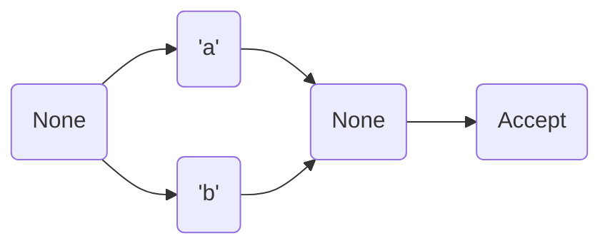
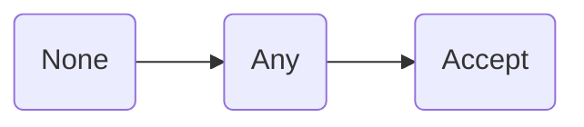
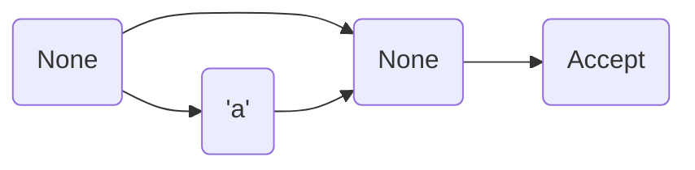
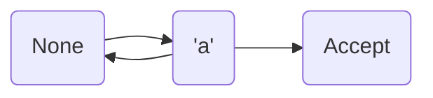
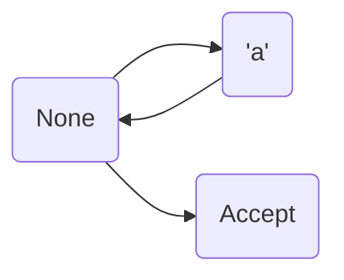
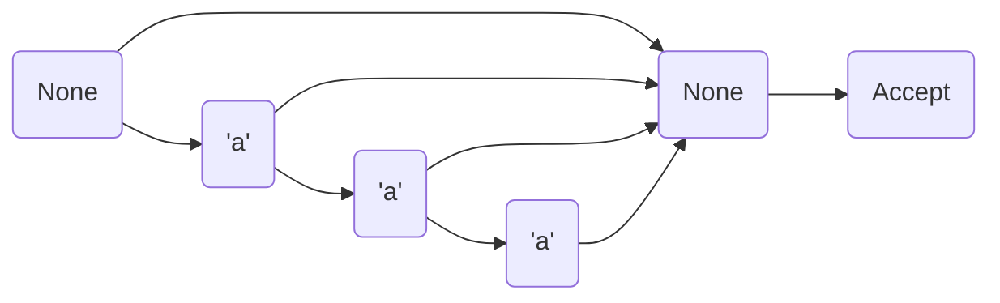
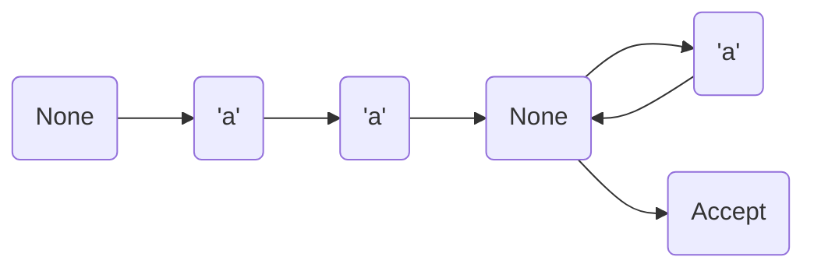
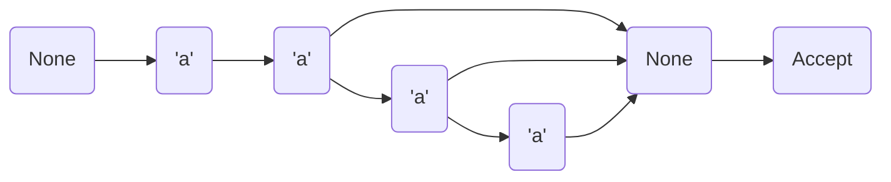
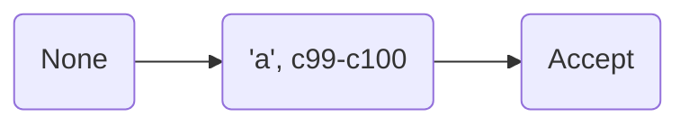
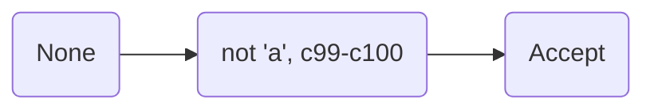

# WORK IN PROGRESS

# Reginald: A from scratch Regular Expression Engine

A very simple regular expression engine written in rust.   

## How it Works

1. A regular expression is inputted as a string into a Lexer

2. The Lexer generates a stream of tokens from the string

3. The parser validates and generates an abstract syntax tree (AST) from the token stream

4. The AST is compiled into a non-deterministic finite state machine

5. Input is given to test against the regular expression

6. The state machine is simulated with the input to determine if a string is apart of the language the regular expression defines

## The State Machine

### States

| State  | Description                                                                                                |
| ------ | ---------------------------------------------------------------------------------------------------------- |
| Symbol | Any character that is the same as the states character will be matched and the state machine will continue |
| Any    | Any character will be matched on this state and the state machine will continue                            |
| Set    | Any character in the set will be matched and the state machine will continue                               |
| NotSet | Any character not in the set will be matched and the state machine will continue                           |
| Accept | A ending state for the state machine                                                                       |
| None   | Used as a connected point between states and is otherwise ignored when simulating the state machine.       |

### Building blocks

#### a\|b

#### .

#### a?

#### a+

#### a*

#### a{,3}

#### a{2,}

#### a{2,4}

#### [ac-d]

#### [^ac-d]

## Syntax

| Tokens | Description                                                                       | Example  |                                                              |
| ------ | --------------------------------------------------------------------------------- | -------- | ------------------------------------------------------------ |
| \|     | will match either what is before or after it                                      | a\|b     | will match with "a" or "b"                                   |
| .      | any                                                                               | .        | will match with any character                                |
| ?      | zero or one, greedy                                                               | a?b      | "ab" or "b"                                                  |
| +      | one or more, greedy                                                               | a+       | one or more "a"                                              |
| \*     | zero or more, greedy                                                              | a*       | zero or more "a"                                             |
| {x,y}  | will match an expression at least x times and at most y times                     | a{,3}    | at most three "a"                                            |
|        |                                                                                   | a{2,}    | at minimum two "a"                                           |
|        |                                                                                   | a{1,3}   | between one and three "a"                                    |
| ()     | allows grouping of regular expressions                                            | (a\|b)\* | will match with "a" or "b" zero or more times                |
| \[\]     | will match with any characters or ranges in the set                               | \[ac-e\]   | will match with "a", "c'", "d", "e"                          |
| \[^\]    | will match with any characters not in the set                                     | \[^ab\]    | will match with any character that is not "a" or "b"         |
| a-z    | a range, used in a set, ranges can only be defined with alphanumerical characters | \[0-z\]    | will match will all numbers and upper and lower case letters |

## License

This software is provided under the MIT license. [Click](LICENSE) here to view.